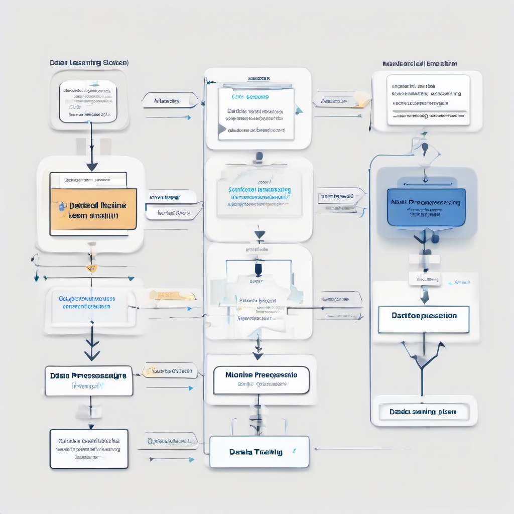

# Introduction to Machine Learning


## What is Machine Learning?
Machine learning is a subset of artificial intelligence that involves training algorithms to learn from data and make predictions or decisions without being explicitly programmed. 
* Define machine learning: It is a field of study that focuses on the use of algorithms and statistical models to enable machines to perform a specific task.
* Explain types of machine learning: There are several types, including supervised, unsupervised, and reinforcement learning, each with its own strengths and weaknesses.
* Provide examples of machine learning applications: Examples include image recognition, natural language processing, and predictive analytics, which are used in various industries such as healthcare, finance, and transportation. 
Machine learning has numerous applications and is a key driver of innovation in many fields, with its performance and edge cases being crucial considerations for developers.



## Machine Learning Workflow
The machine learning workflow is a series of steps that help developers build and deploy effective machine learning models. To start a machine learning project, several key steps are involved:
* Data collection: This is the initial step where data relevant to the problem is gathered. The quality and quantity of the data collected have a significant impact on the performance of the model.
* Data preprocessing: After collecting the data, it needs to be cleaned and preprocessed to ensure it is in a suitable format for the model. This step involves handling missing values, removing duplicates, and scaling the data.
* Model selection: With the preprocessed data, the next step is to choose a suitable machine learning algorithm. The choice of model depends on the type of problem, the size of the dataset, and the desired outcome.
* Model training: Once the model is selected, it is trained using the preprocessed data. The goal of this step is to find the optimal parameters that result in the best performance.
* Model evaluation: After training the model, its performance is evaluated using various metrics such as accuracy, precision, and recall. This step helps to identify the strengths and weaknesses of the model and provides insights for further improvement. 
Considering edge cases and performance considerations, developers should be aware of potential issues that may arise during these steps, such as overfitting or underfitting, and take necessary measures to address them. By following these basic steps and being mindful of potential pitfalls, developers can build effective machine learning models that deliver reliable results.


## Common Mistakes in Machine Learning
When working on machine learning projects, it's essential to be aware of common mistakes that can hinder performance and accuracy. These mistakes can be easily avoided with a good understanding of the underlying concepts. 
* Overfitting occurs when a model is too complex and learns the training data too well, resulting in poor performance on new, unseen data.
* Underfitting happens when a model is too simple and fails to capture the underlying patterns in the training data, leading to subpar performance.
* Data leakage is another common issue, where information from the test data is inadvertently used during training, causing the model to perform unrealistically well on the test set, but poorly on real-world data. 
By recognizing these potential pitfalls, developers can take steps to mitigate them and develop more robust and accurate machine learning models.


## Machine Learning Example
To implement a simple machine learning model, several key steps must be followed. The process begins with selecting a suitable dataset. 
* Choose a dataset: This is a crucial step as the quality and relevance of the data will directly impact the performance of the model. A dataset should be chosen based on the problem you are trying to solve, and it should be large enough to train the model effectively.

Once the dataset is chosen, the next step is to select a suitable model. 
* Select a model: There are various machine learning models available, including linear regression, decision trees, and neural networks. The choice of model depends on the type of problem you are trying to solve and the characteristics of your dataset.

After selecting the model, the next step is to train it. 
* Train the model: Training a model involves feeding it with the chosen dataset and adjusting its parameters to minimize the error between predicted and actual outputs. This can be done using various algorithms, such as gradient descent.

Finally, the trained model needs to be evaluated to determine its performance. 
* Evaluate the model: Evaluation involves testing the model on a separate dataset to determine its accuracy and reliability. This can be done using metrics such as mean squared error or accuracy score.

Here's a minimal code sketch in Python to illustrate the process:
```python
from sklearn import datasets
from sklearn.model_selection import train_test_split
from sklearn.linear_model import LinearRegression
from sklearn.metrics import mean_squared_error

# Load the dataset
dataset = datasets.load_diabetes()

# Split the dataset into training and testing sets
X_train, X_test, y_train, y_test = train_test_split(dataset.data, dataset.target, test_size=0.2, random_state=42)

# Create and train a linear regression model
model = LinearRegression()
model.fit(X_train, y_train)

# Make predictions and evaluate the model
y_pred = model.predict(X_test)
mse = mean_squared_error(y_test, y_pred)
print(f"Mean squared error: {mse}")
```
This code sketch demonstrates how to choose a dataset, select a model, train the model, and evaluate its performance. It also highlights the importance of considering edge cases and performance considerations when implementing machine learning models.

## Conclusion
In this introduction to machine learning, key points include understanding the basics of machine learning and its applications. 
* Summarize key points: Machine learning is a subset of artificial intelligence that involves training algorithms to make predictions or decisions based on data.
* Provide resources for further learning: For developers looking to dive deeper, online courses and tutorials are available to explore machine learning concepts and implementation. 
Machine learning has various applications, and its performance considerations are crucial for optimal results.